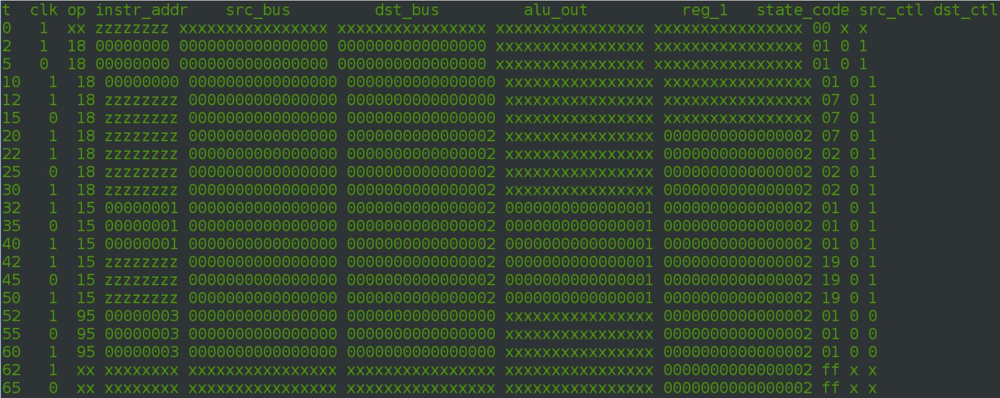
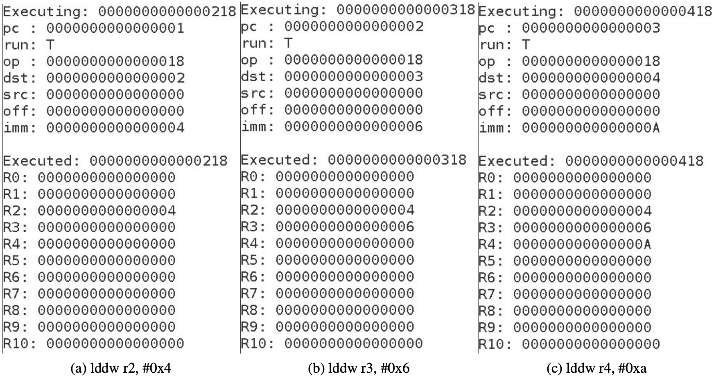
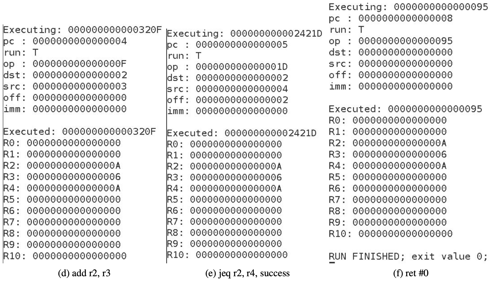

This is an emulator that can execute simple eBPF programs and was written to help with learning the instruction set. It is a higher-level description of a soft core.

## To run

* cd src
* mkdir build && cd build
* cmake ..
* make
* ./main

**Note**: eBPF source is currently hard-coded in main() to "basic.bpf"

## Architecture

This software implementation follows a simplified state machine design. It takes a BPF program as input and is run in simulated clock cycles, displaying the state of all registers at each cycle. It supports both 32 and 64 bit BPF instructions.

## Examples

### 1. Running a short filter

#### Input:
```
    loadw r1, #2
    jeq r1, #2, lb
    loadw r4, #2

lb: exit
```
#### Output:



### 2. Basic addition

#### Input:
```
    ; load constants into registers
    lddw r2, #0x4
    lddw r3, #0x6
    lddw r4, #0xa
    
    ; 0x4 + 0x6 = 0xa
    add r2, r3
    jeq r2, r4, success
    
    ; drop packet
    ret #1

success:
    ret #0
```

#### Output:

